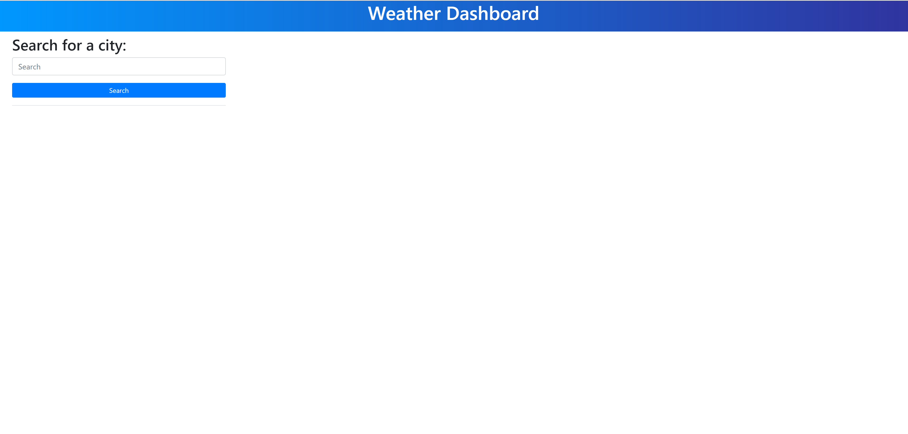
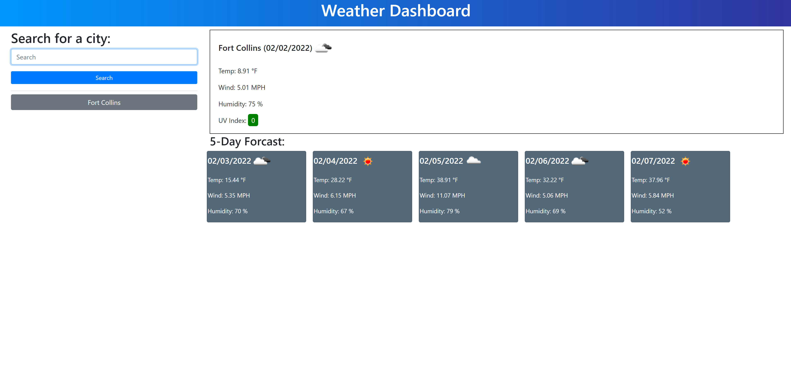
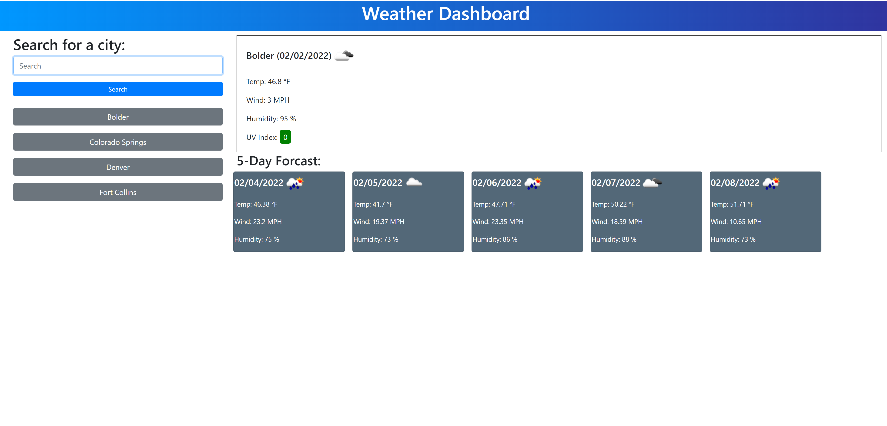
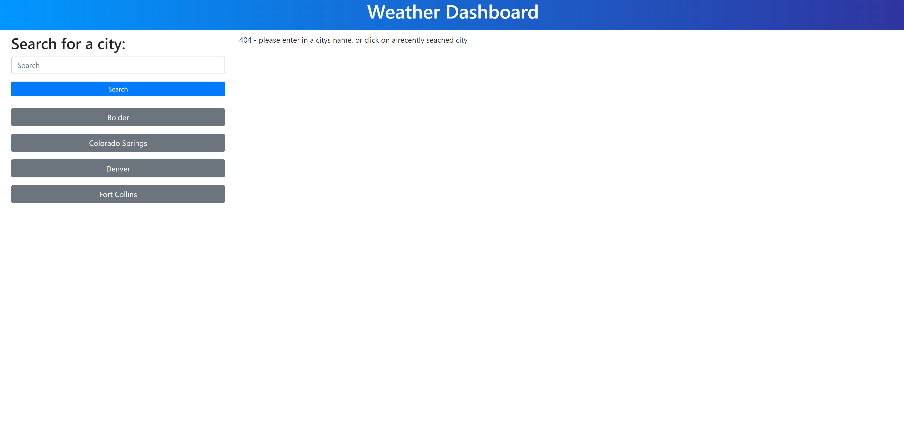

About the project: The goal of the project was to create a weather dashboard. The user is able to search for a city and then be presented with the current weather, as well as a 5 day weather forecast. After the user searches for a city the city is added to a search history. The user then has the ability to click on a recently searched for city to populate the page with that city's weather information. 

Built using: HTML, CSS, Javascript, Bootstrap, jQuery, and OpenWeather One Call API 

Usage: On page load the user is presented with a search box and recently searched for cities (if applicable). The user then needs to click on the search box and type in a city's name. If the city does not exist a 404 error is presented to the user. If the city does exist the user is then shown the current and future weather. The value for the UV index has a background color that changes based on the value. 
When a user searches for a city it is added to their search history. If the city already is in the search history, it is not added. When the user clicks on a city in their search history it populates the page with the weather information for that city. The user has a maximum of 8 recent searches.

Images: When the page loads for the first time the user is presented with a search box, and no search history

When the user searches for a city the page is populated with the current weather and a 5 day weather forecast

When the user has searched for multiple cities, each search is added to a search history bar on the left side of the page

When the user searches for a city that does not exist a 404 message is shown. The search is also not added to the search history

The deployed website can be found at:
https://nileshachmeister.github.io/week6homework-weather-dashboard/

sources:

This website was used to help create the gradiant for the header:
https://cssgradient.io/

This website was used to help create the color for the 5 day weather forcast cards:
https://www.schemecolor.com/sample?getcolor=536878

This website was used to figure out how to get the lat/long values to then put into OpenWeather One Call API:
https://stackoverflow.com/questions/65373299/how-can-i-use-city-name-instead-of-lat-and-log-in-openweather-api

This website has documentation for the OpenWeather API:
https://openweathermap.org/current

This website has documentation on OpenWeather One Call API:
https://openweathermap.org/api/one-call-api

The comments in this reddit thread was used to figure out how to display the icons:
https://www.reddit.com/r/FreeCodeCamp/comments/4con5s/how_do_i_use_the_icon_given_in_the_open_weather/

This website was used to figure out how to convert unix time into the date:
https://stackoverflow.com/questions/40752287/use-moment-js-to-convert-unix-epoch-time-to-human-readable-time
